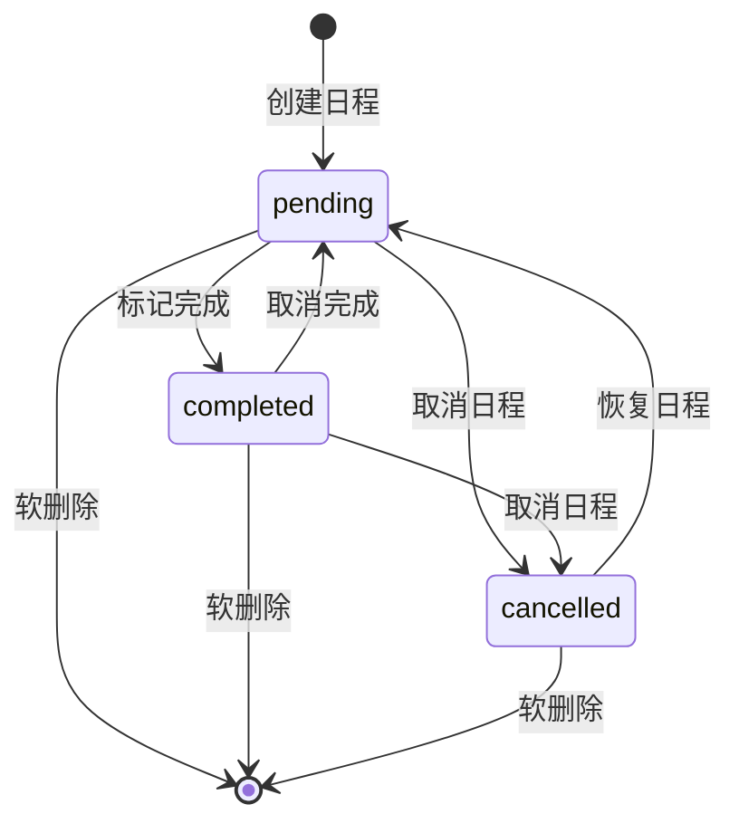
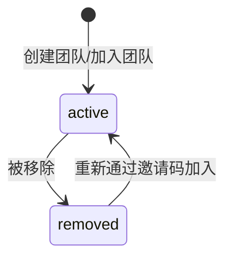
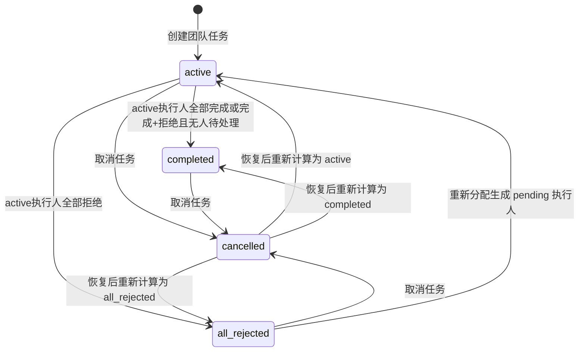
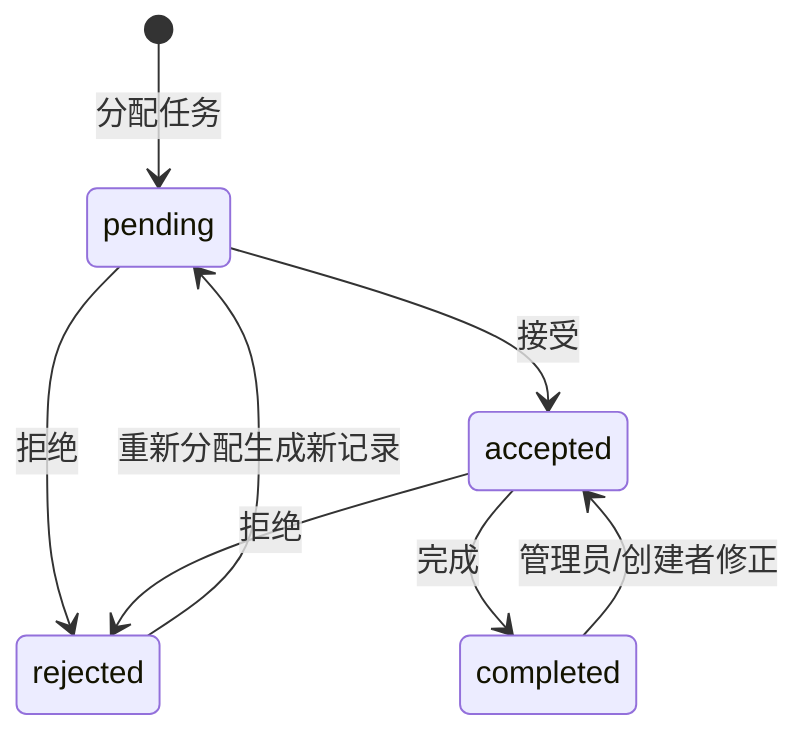

# 日程提醒 App — 业务状态流转文档

> 范围：MVP 业务状态、状态变更前置条件、提醒/通知联动

---

## 1. 个人日程状态流转

个人日程状态：
- `pending`：待完成
- `completed`：已完成
- `cancelled`：已取消

规则：
- 删除是软删除，通过 `deleted_at` 判断，不属于业务状态。
- 完成日程后，关联 pending reminder 自动取消。
- 取消日程后，关联 pending reminder 自动取消。
- 恢复已取消日程后，已过期提醒不自动恢复；未来提醒可重新生成。

---

## 2. 个人日程时间类型

数据库只保存：
- `point_event`
- `deadline_task`

前端展示推导：

| 条件 | 展示类型 | 展示方式 |
| --- | --- | --- |
| `time_type=point_event` | 瞬时日程 | 时间轴圆点 + 普通卡片 |
| `time_type=deadline_task` 且只有 `deadline_time` | 截止任务 | 截止节点 + 截止卡片 |
| `time_type=deadline_task` 且有 `start_time + deadline_time` | 持续任务 | 起止节点 + 竖向持续条 |

---

## 3. 团队成员状态流转

团队成员状态：
- `active`
- `removed`

规则：
- 创建团队时，创建者同步成为 `owner + active` 成员。
- `team.owner_id` 必须与 active owner 成员一致。
- 被移除成员不能访问团队。
- 被移除成员重新加入时，复用原 `team_member` 记录。
- 被移除成员的未完成执行人记录保留原状态，但 `is_active=false`。

---

## 4. 团队任务整体状态流转

团队任务整体状态：
- `active`：进行中
- `completed`：已完成
- `all_rejected`：全部拒绝
- `cancelled`：已取消

整体状态只基于 `is_active=true` 的执行人记录计算。

| active 执行人状态组合 | 整体状态 |
| --- | --- |
| 存在 `pending` 或 `accepted` | `active` |
| 全部 `completed` | `completed` |
| 全部 `rejected` | `all_rejected` |
| 有 `completed + rejected`，且无 `pending/accepted` | `completed` |

---

## 5. 执行人状态流转

执行人状态：
- `pending`：待接受
- `accepted`：已接受
- `rejected`：已拒绝
- `completed`：已完成

规则：
- 执行人只能操作自己的 `is_active=true` 记录。
- 已取消团队任务不允许执行人继续接受、拒绝或完成。
- 普通执行人不能自行撤回完成。
- 状态修正只能由任务创建者或 owner/admin 操作。
- 重新分配不修改原记录状态，只将原记录 `is_active=false`，并新增一条 pending 记录。

---

## 6. 重新分配规则

触发条件：
- 原执行人当前 active 记录状态必须是 `rejected`。
- 新执行人必须是当前团队 active 成员。

处理步骤：
1. 找到 `originalAssigneeUserId` 对应的 active rejected 记录。
2. 将原记录 `is_active=false`。
3. 新增执行人记录：`pending + is_active=true + assign_round+1`。
4. 为新执行人生成 reminder。
5. 给新执行人发送任务分配通知。
6. 重新计算团队任务整体状态。

---

## 7. 取消与恢复规则

### 7.1 团队任务取消

- 权限：任务创建者、team owner/admin。
- 状态改为 `cancelled`。
- 关联 pending reminder 自动取消。
- 执行人不能继续操作。

### 7.2 团队任务恢复

- 权限：team owner/admin。
- 恢复后不固定为 active。
- 根据 active 执行人状态重新计算整体状态。
- 执行人原状态不变。

---

## 8. 提醒与通知联动

| 场景 | reminder | notification |
| --- | --- | --- |
| 创建个人日程 | 根据 `remindAts` 创建 | 不立即通知 |
| 日程到提醒时间 | `pending -> sent` | 给日程用户生成通知 |
| 日程完成/取消 | pending reminder -> cancelled | 不强制通知 |
| 创建团队任务 | 为每个执行人创建 reminder | 给执行人发送任务分配通知 |
| 执行人接受 | 不变 | 通知任务创建者 |
| 执行人拒绝 | 该执行人 pending reminder -> cancelled | 通知任务创建者 |
| 执行人完成 | 该执行人 pending reminder -> cancelled | 通知任务创建者 |
| 团队任务取消 | 所有 pending reminder -> cancelled | 通知执行人 |
| 重新分配 | 新执行人创建 reminder | 通知新执行人 |

---

## 9. 逾期展示规则

- 逾期不是数据库业务状态。
- 逾期由前端根据当前时间与 `deadlineTime` 计算。
- 未完成且超过截止时间时展示为“已逾期”。
- 逾期任务在同一分组内置顶。
- 逾期可触发站内通知，但不改变 `status` 字段。