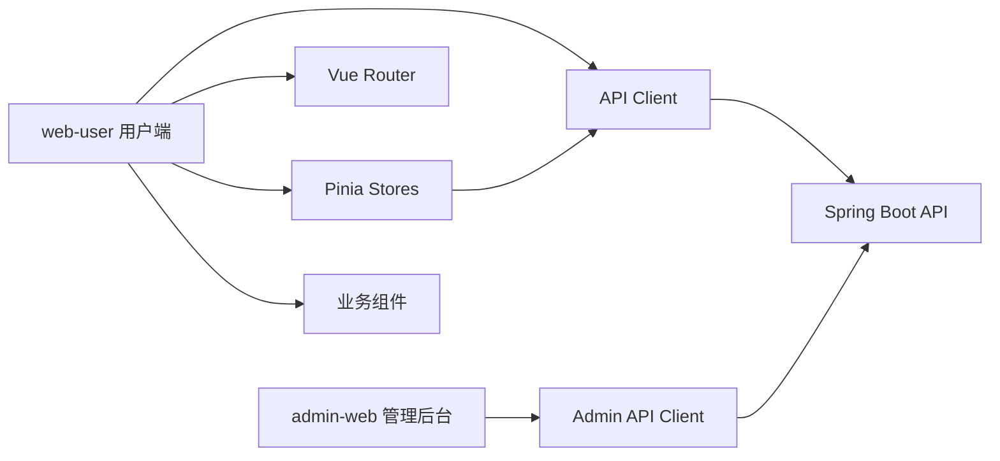

# 日程提醒 App — 前端架构设计文档

> 技术栈：Vue 3 + TypeScript + Vite + Element Plus + Pinia + Vue Router  
> 范围：MVP 用户端 Web + 基础后台前端约定

---

## 1. 前端总体架构

MVP 前端分为两个应用：

| 应用 | 说明 | 技术方案 |
| --- | --- | --- |
| 用户端 Web | 个人日程、团队、团队任务、通知、我的 | Vue 3 + Vite + Element Plus |
| 管理后台 | 用户、团队、任务、提醒、通知、日志管理 | Vue Pure Admin |

用户端不直接使用完整后台模板，避免产品体验过重。后台可以使用 Vue Pure Admin。



---

## 2. 用户端目录结构

```text
src/web-user/
├── src/
│   ├── api/
│   │   ├── http.ts
│   │   ├── auth.ts
│   │   ├── user.ts
│   │   ├── schedule.ts
│   │   ├── team.ts
│   │   ├── teamTask.ts
│   │   ├── reminder.ts
│   │   └── notification.ts
│   ├── assets/
│   ├── components/
│   │   ├── AppLayout.vue
│   │   ├── AppSidebar.vue
│   │   ├── StatusTag.vue
│   │   ├── CountdownPill.vue
│   │   ├── TaskTimeline.vue
│   │   ├── TaskCard.vue
│   │   ├── GroupSection.vue
│   │   └── EmptyState.vue
│   ├── router/
│   │   ├── index.ts
│   │   └── guards.ts
│   ├── stores/
│   │   ├── auth.ts
│   │   ├── user.ts
│   │   ├── schedule.ts
│   │   ├── team.ts
│   │   ├── teamTask.ts
│   │   └── notification.ts
│   ├── utils/
│   │   ├── time.ts
│   │   ├── countdown.ts
│   │   ├── timeline.ts
│   │   └── permission.ts
│   ├── views/
│   │   ├── auth/
│   │   ├── home/
│   │   ├── calendar/
│   │   ├── schedule/
│   │   ├── team/
│   │   ├── team-task/
│   │   ├── notification/
│   │   └── profile/
│   ├── App.vue
│   └── main.ts
├── index.html
└── vite.config.ts
```

---

## 3. 路由设计

| 路由 | 页面 | 鉴权 |
| --- | --- | --- |
| `/login` | 登录页 | 否 |
| `/register` | 注册页 | 否 |
| `/` | 首页 / 我的任务总览 | 是 |
| `/calendar` | 日历页 | 是 |
| `/schedules` | 个人日程列表 | 是 |
| `/schedules/new` | 新建个人日程 | 是 |
| `/schedules/:id` | 日程详情 | 是 |
| `/schedules/:id/edit` | 编辑日程 | 是 |
| `/teams` | 团队列表 | 是 |
| `/teams/:id` | 团队详情 | 是 |
| `/teams/:id/members` | 团队成员 | 是 |
| `/team-tasks` | 团队任务列表 | 是 |
| `/team-tasks/new` | 新建团队任务 | 是 |
| `/team-tasks/:id` | 团队任务详情 | 是 |
| `/notifications` | 通知中心 | 是 |
| `/profile` | 我的 | 是 |
| `/profile/password` | 修改密码 | 是 |
| `/profile/timezone` | 时区设置 | 是 |

路由守卫规则：
- 未登录访问鉴权页面，跳转 `/login`。
- 已登录访问 `/login` 或 `/register`，跳转首页。
- Access Token 过期时尝试 refresh token，刷新失败则退出登录。

---

## 4. Pinia Store 划分

| Store | 职责 |
| --- | --- |
| `authStore` | accessToken、refreshToken、登录、退出、刷新 token |
| `userStore` | 当前用户资料、时区、密码修改 |
| `scheduleStore` | 个人日程列表、详情、日历数据、增删改查 |
| `teamStore` | 团队列表、团队详情、成员管理、邀请码 |
| `teamTaskStore` | 团队任务列表、详情、执行人状态流转、重新分配 |
| `notificationStore` | 通知列表、未读数、标记已读 |

---

## 5. API 封装约定

统一使用 `src/api/http.ts` 封装请求：
- 自动添加 `Authorization: Bearer {accessToken}`。
- 统一处理 `401`，尝试刷新 Token。
- 统一处理错误消息。
- 统一解析 `{ code, message, data }`。

接口文件按业务模块拆分，不在 Vue 组件中直接写 URL。

---

## 6. 核心组件设计

### 6.1 `CountdownPill`

输入：
- `deadlineTime`
- `status`
- `now`

展示：
- 大于 24 小时：`剩余 X 天`
- 小于等于 24 小时：`X小时X分`
- 小于等于 30 分钟：橙色
- 小于等于 10 分钟：红色
- 已逾期：`已逾期 X分钟 / X小时 / X天`
- 已完成：`已完成`
- 已取消：`已取消`

### 6.2 `TaskTimeline`

支持三类展示：
- `point_event`：圆点节点。
- `deadline_task`：截止节点。
- `duration_task`：持久化时间类型，使用 `startTime + endTime`，展示起止节点和竖向持续条。

### 6.3 `StatusTag`

状态颜色：
- `pending`：蓝色
- `accepted`：蓝色
- `rejected`：红色
- `completed`：绿色
- `active`：蓝色
- `all_rejected`：红色
- `cancelled`：灰色
- 逾期展示状态：红色

### 6.4 `GroupSection`

MVP 支持：
- 默认分组：生活、工作、学习、团队任务、未分组。
- 分组折叠/展开。
- 分组未完成数量展示。
- 已完成任务独立分组。

V1.1 再支持：
- 分组重命名、删除、排序。
- 跨分组拖拽。

---

## 7. 时间处理规则

- 所有接口时间使用 ISO8601。
- 后端存 UTC，前端按用户 `timezone` 显示。
- 前端倒计时不依赖后端返回字符串，统一在 `utils/countdown.ts` 中计算。
- 时间轴展示类型统一在 `utils/timeline.ts` 中推导。

---

## 8. 权限按钮显示规则

团队任务详情页：
- 创建者、owner/admin：显示编辑、修改时间、取消、重新分配、删除。
- 执行人：只显示接受、拒绝、完成，并且只能操作自己的 active assignee 记录。
- 已取消任务：执行人按钮全部隐藏。
- rejected 执行人：创建者、owner/admin 显示重新分配按钮。

团队成员页：
- owner：可设置/取消 admin，可移除 admin/member。
- admin：只可移除 member。
- member：无成员管理按钮。

---

## 9. 空状态和错误状态

| 场景 | 展示 |
| --- | --- |
| 无今日待办 | 显示“今天没有待办”与新建按钮 |
| 无团队 | 显示创建团队、加入团队入口 |
| 无通知 | 显示“暂无通知” |
| 接口错误 | 顶部消息提示，保留当前页面 |
| 无权限 | 显示 403 页面或返回上一页 |
| 资源不存在 | 显示 404 页面 |
