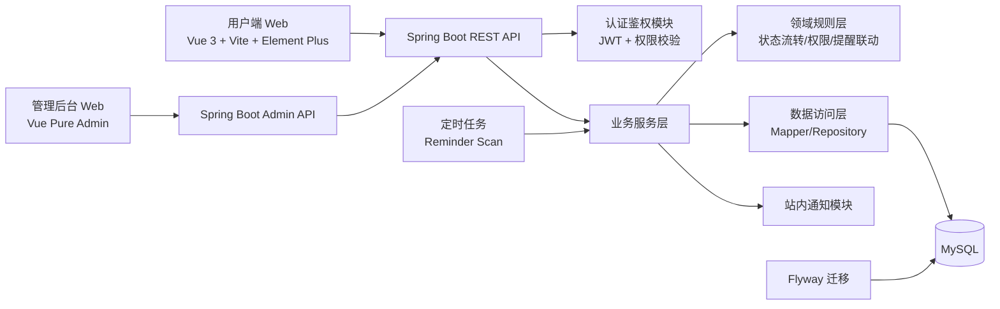
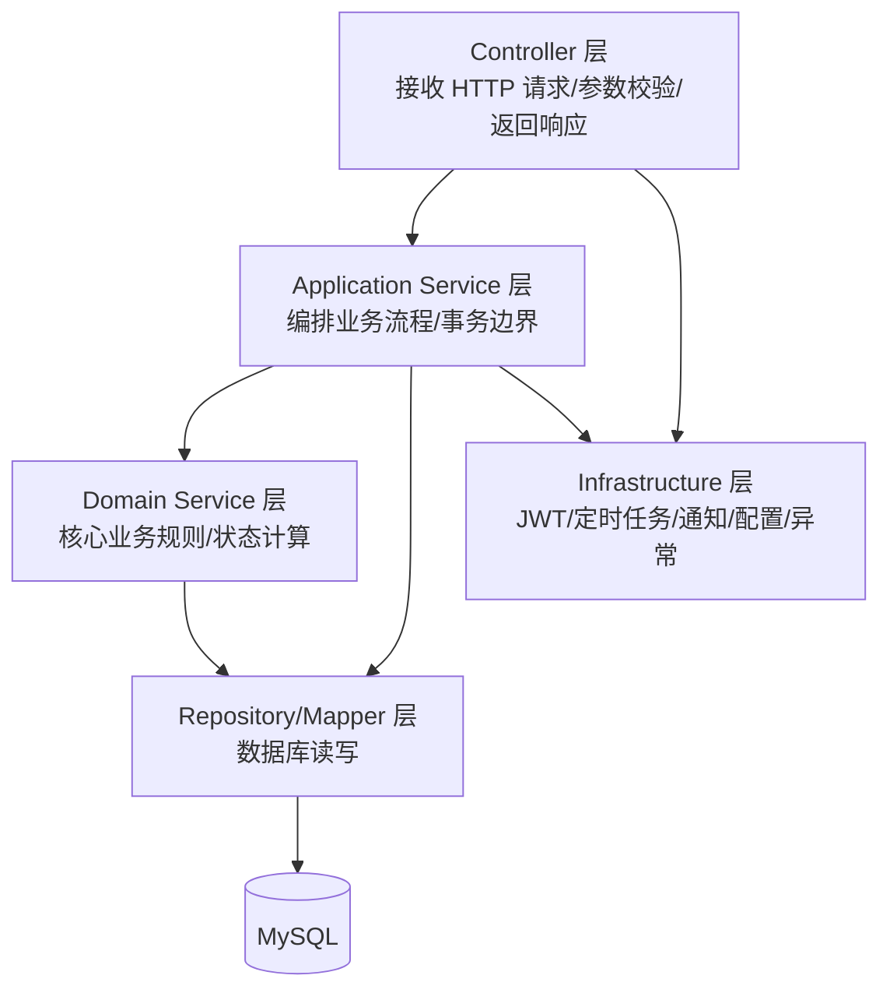
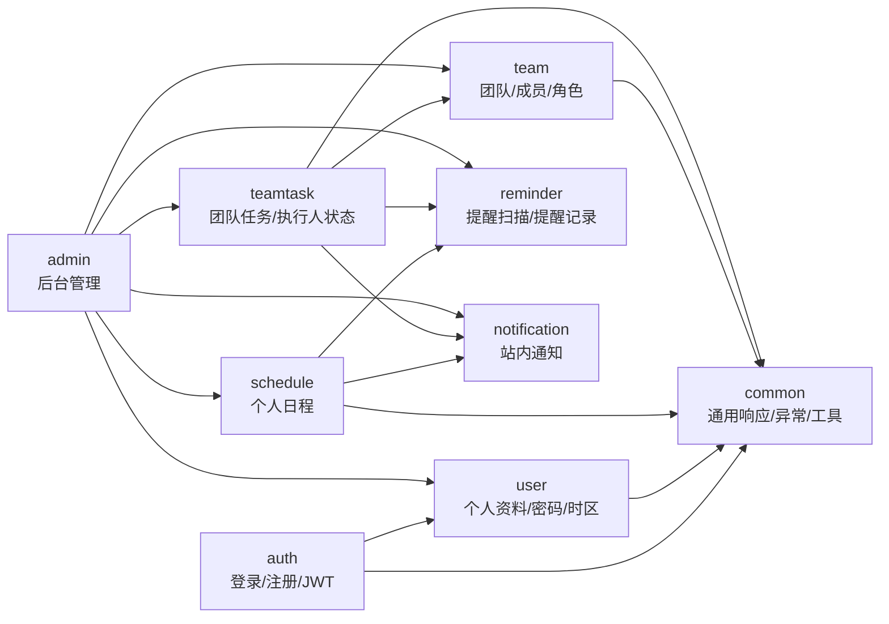
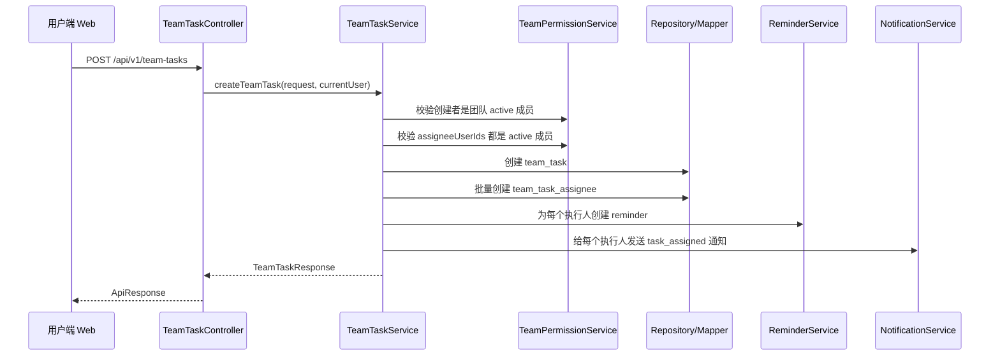
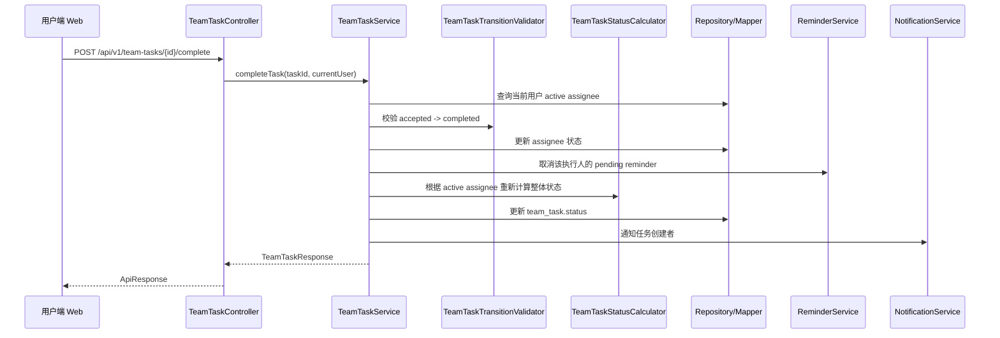
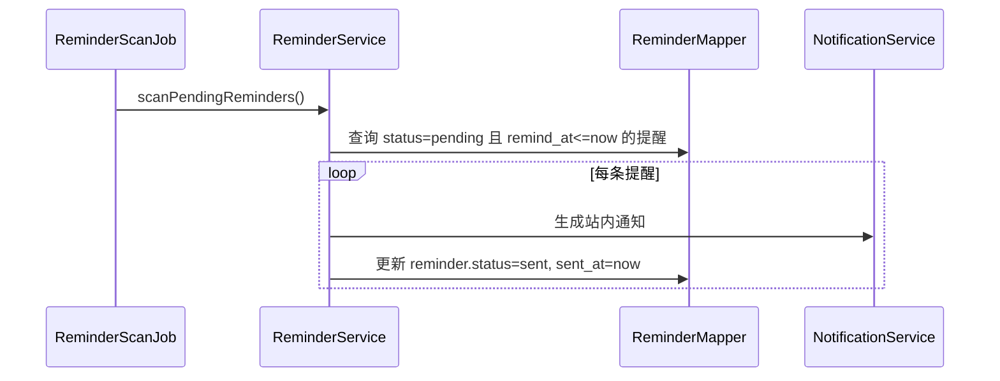

# 日程提醒 App — 系统架构设计文档

> 基于 `日程提醒App计划文档.md`、`数据库设计文档.md`、`API接口设计文档.md` 整理  
> 后端技术栈：Spring Boot + MySQL + Flyway + JWT  
> 版本范围：MVP

---

## 1. 总体架构

MVP 采用前后端分离架构。用户端 Web、管理后台 Web 都通过统一 REST API 访问 Spring Boot 后端，后端负责认证、权限、业务规则、提醒扫描、通知生成和数据持久化。



---

## 2. 后端分层架构

建议后端采用“接口层 / 应用服务层 / 领域规则层 / 数据访问层 / 基础设施层”的分层方式。MVP 不需要过度 DDD，但要把 Controller、Service、Mapper、DTO、Entity、权限校验分清楚。



### 2.1 Controller 层

职责：
- 暴露 `/api/v1/**` 和 `/api/v1/admin/**` 接口。
- 接收请求参数并做基础参数校验。
- 获取当前登录用户或管理员身份。
- 调用应用服务层，不直接写业务规则。
- 返回统一响应格式。

不建议：
- 在 Controller 中直接操作数据库。
- 在 Controller 中写任务状态计算、团队权限判断等复杂规则。

### 2.2 Application Service 层

职责：
- 作为主要事务边界。
- 编排多个领域动作，例如创建团队任务时同时创建任务、执行人记录、提醒、通知。
- 调用领域服务做规则判断。
- 调用 Repository/Mapper 完成数据读写。

典型服务：
- `AuthService`
- `UserService`
- `ScheduleService`
- `TeamService`
- `TeamTaskService`
- `NotificationService`
- `ReminderService`
- `AdminService`

### 2.3 Domain Service 层

职责：
- 放置不依赖 HTTP 的核心业务规则。
- 便于单元测试。

典型规则：
- 团队角色权限判断。
- 团队任务整体状态计算。
- 执行人状态流转校验。
- 被移除成员的任务处理规则。
- 提醒与状态联动规则。
- 时间轴展示类型推导。

示例：
```text
TeamTaskStatusCalculator
- 只基于 is_active = true 的执行人记录计算整体状态
- 存在 pending/accepted => active
- 全部 completed => completed
- 全部 rejected => all_rejected
- completed + rejected 且无 pending/accepted => completed
```

### 2.4 Repository / Mapper 层

职责：
- 封装数据库访问。
- 提供按业务语义命名的查询方法。
- 默认过滤软删除数据。

建议：
- 如果使用 MyBatis Plus：Entity + Mapper + QueryWrapper。
- 如果使用 JPA：Entity + Repository。
- MVP 推荐 MyBatis Plus，和国内 Spring Boot 项目生态更贴近，表结构控制更直接。

### 2.5 Infrastructure 层

职责：
- JWT 生成、解析、刷新。
- 登录拦截器 / Spring Security 配置。
- 全局异常处理。
- 统一响应包装。
- 定时任务配置。
- 环境配置读取。
- 操作日志记录。

---

## 3. 后端模块划分



### 3.1 auth 模块

负责：
- 用户注册。
- 用户登录。
- 用户退出。
- Access Token / Refresh Token 刷新。
- 密码 BCrypt 加密校验。

主要接口：
- `POST /api/v1/auth/register`
- `POST /api/v1/auth/login`
- `POST /api/v1/auth/logout`
- `POST /api/v1/auth/refresh-token`

### 3.2 user 模块

负责：
- 当前用户资料。
- 修改昵称、头像。
- 修改密码。
- 设置默认时区。

主要表：
- `user`

### 3.3 schedule 模块

负责：
- 个人日程增删改查。
- 完成 / 取消完成。
- 取消 / 恢复日程。
- 日历视图数据。
- 分组字段 `group_name`。
- 时间轴展示类型推导所需字段返回。

核心规则：
- `time_type` 只允许 `point_event` / `deadline_task`。
- `duration_task` 不入库，由前端根据 `start_time + deadline_time` 推导。
- 日程完成或取消后，未发送 reminder 自动取消。

### 3.4 team 模块

负责：
- 创建团队。
- 邀请码生成和重新生成。
- 加入团队。
- 团队成员列表。
- 成员角色修改。
- 成员移除与重新加入。

核心规则：
- 创建团队时同步创建 owner 的 `team_member` 记录。
- `team.owner_id` 与 active owner 成员保持一致。
- 被移除成员不能再访问团队。
- 被移除成员重新加入时复用原 `team_member` 记录。

### 3.5 teamtask 模块

负责：
- 团队任务创建、查询、编辑、删除。
- 执行人接受、拒绝、完成。
- 任务取消、恢复。
- 被拒绝任务重新分配。
- 管理员/创建者修正执行人状态。

核心规则：
- 创建者不自动成为执行人。
- 执行人必须是当前团队 active 成员。
- 状态流转：
  - `pending -> accepted`
  - `pending/accepted -> rejected`
  - `accepted -> completed`
- `cancelled` 任务不允许执行人继续操作。
- `is_active = false` 的执行人记录不允许操作。
- 整体状态只基于 `is_active = true` 的执行人记录计算。

### 3.6 reminder 模块

负责：
- 创建提醒记录。
- 取消未发送提醒。
- 定时扫描待发送提醒。
- 生成对应站内通知。

核心规则：
- 每个提醒时间一条 `reminder` 记录。
- 团队任务为每个执行人分别生成提醒。
- MVP 只给执行人发截止提醒，创建者只收状态变化通知。

### 3.7 notification 模块

负责：
- 创建站内通知。
- 查询通知列表。
- 未读数统计。
- 标记已读 / 全部已读。

通知来源：
- 日程提醒。
- 团队任务分配。
- 成员接受、拒绝、完成任务。
- 任务重新分配、取消。

### 3.8 admin 模块

负责：
- 管理员登录、退出、资料。
- 用户管理。
- 团队管理。
- 个人日程查看。
- 团队任务查看。
- 通知记录查看。
- 提醒记录查看。
- 管理员账号管理。
- 管理员操作日志。

---

## 4. 推荐包结构

建议后端项目包名：`com.dayliane`。

```text
backend/
└── src/main/java/com/dayliane/
    ├── DaylianeApplication.java
    ├── common/
    │   ├── api/
    │   │   ├── ApiResponse.java
    │   │   ├── PageRequest.java
    │   │   └── PageResult.java
    │   ├── exception/
    │   │   ├── BusinessException.java
    │   │   ├── ErrorCode.java
    │   │   └── GlobalExceptionHandler.java
    │   ├── security/
    │   │   ├── CurrentUser.java
    │   │   ├── CurrentAdmin.java
    │   │   ├── JwtTokenProvider.java
    │   │   └── AuthInterceptor.java
    │   └── util/
    │       ├── TimezoneUtils.java
    │       └── InviteCodeUtils.java
    ├── auth/
    │   ├── controller/AuthController.java
    │   ├── service/AuthService.java
    │   └── dto/
    ├── user/
    │   ├── controller/UserController.java
    │   ├── service/UserService.java
    │   ├── mapper/UserMapper.java
    │   ├── entity/UserEntity.java
    │   └── dto/
    ├── schedule/
    │   ├── controller/ScheduleController.java
    │   ├── service/ScheduleService.java
    │   ├── domain/ScheduleTimeTypeResolver.java
    │   ├── mapper/ScheduleMapper.java
    │   ├── entity/ScheduleEntity.java
    │   └── dto/
    ├── team/
    │   ├── controller/TeamController.java
    │   ├── service/TeamService.java
    │   ├── domain/TeamPermissionService.java
    │   ├── mapper/TeamMapper.java
    │   ├── mapper/TeamMemberMapper.java
    │   ├── entity/TeamEntity.java
    │   ├── entity/TeamMemberEntity.java
    │   └── dto/
    ├── teamtask/
    │   ├── controller/TeamTaskController.java
    │   ├── service/TeamTaskService.java
    │   ├── domain/TeamTaskStatusCalculator.java
    │   ├── domain/TeamTaskTransitionValidator.java
    │   ├── mapper/TeamTaskMapper.java
    │   ├── mapper/TeamTaskAssigneeMapper.java
    │   ├── entity/TeamTaskEntity.java
    │   ├── entity/TeamTaskAssigneeEntity.java
    │   └── dto/
    ├── reminder/
    │   ├── controller/ReminderController.java
    │   ├── service/ReminderService.java
    │   ├── scheduler/ReminderScanJob.java
    │   ├── mapper/ReminderMapper.java
    │   ├── entity/ReminderEntity.java
    │   └── dto/
    ├── notification/
    │   ├── controller/NotificationController.java
    │   ├── service/NotificationService.java
    │   ├── mapper/NotificationMapper.java
    │   ├── entity/NotificationEntity.java
    │   └── dto/
    └── admin/
        ├── controller/AdminAuthController.java
        ├── controller/AdminUserController.java
        ├── controller/AdminTeamController.java
        ├── controller/AdminScheduleController.java
        ├── controller/AdminTeamTaskController.java
        ├── controller/AdminNotificationController.java
        ├── controller/AdminReminderController.java
        ├── controller/AdminOperationLogController.java
        ├── service/AdminService.java
        ├── service/AdminOperationLogService.java
        ├── mapper/AdminUserMapper.java
        ├── mapper/AdminOperationLogMapper.java
        ├── entity/AdminUserEntity.java
        ├── entity/AdminOperationLogEntity.java
        └── dto/
```

---

## 5. DTO 命名建议

每个模块内部按请求和响应拆分 DTO，避免直接把 Entity 暴露给前端。

```text
CreateScheduleRequest
UpdateScheduleRequest
ScheduleResponse
ScheduleListItemResponse
ScheduleCalendarResponse

CreateTeamRequest
JoinTeamRequest
TeamResponse
TeamMemberResponse

CreateTeamTaskRequest
UpdateTeamTaskRequest
UpdateTeamTaskTimeRequest
TeamTaskResponse
TeamTaskListItemResponse
TeamTaskAssigneeResponse
ReassignTeamTaskRequest
UpdateAssigneeStatusRequest

NotificationResponse
ReminderResponse
```

---

## 6. 事务边界建议

以下操作必须放在事务中：

| 操作 | 原因 |
| --- | --- |
| 用户注册 | 创建用户与返回 token 需要一致 |
| 创建团队 | 同时创建 `team` 和 owner 的 `team_member` |
| 加入团队 | 更新/创建 `team_member`，需要处理 removed 恢复 |
| 移除成员 | 更新 `team_member`，同步处理未完成执行人记录 |
| 创建个人日程 | 创建 `schedule`，同时创建 reminder |
| 完成/取消日程 | 更新日程状态，同时取消 pending reminder |
| 创建团队任务 | 创建 `team_task`、assignee、reminder、notification |
| 接受/拒绝/完成任务 | 更新 assignee，重新计算 team_task 状态，生成通知，处理 reminder |
| 重新分配任务 | 旧 assignee 失效，新 assignee 创建，生成 reminder/notification，更新整体状态 |
| 取消/恢复任务 | 更新任务状态，同步处理 reminder |
| 后台重要操作 | 业务变更与 admin_operation_log 写入保持一致 |

---

## 7. 核心流程架构

### 7.1 创建团队任务



### 7.2 执行人完成任务



### 7.3 提醒扫描



---

## 8. 模块依赖规则

为避免后端代码后期混乱，建议遵守以下依赖方向：

```text
controller -> service -> domain/repository -> entity
service -> other service（允许，但避免循环依赖）
admin -> 各业务 service（允许）
业务模块 -> admin（禁止）
repository/mapper -> service（禁止）
entity -> dto/controller/service（禁止）
```

允许的跨模块调用：
- `teamtask` 调用 `team` 的权限校验能力。
- `schedule` 和 `teamtask` 调用 `reminder` 创建/取消提醒。
- `schedule`、`teamtask`、`reminder` 调用 `notification` 创建通知。
- `admin` 调用各业务服务完成后台管理。

---

## 9. 配置文件结构

```text
backend/src/main/resources/
├── application.yml
├── application-dev.yml
├── application-test.yml
├── application-prod.yml
└── db/migration/
    ├── V1__init_user_and_admin.sql
    ├── V2__init_schedule_and_reminder.sql
    ├── V3__init_team.sql
    ├── V4__init_team_task.sql
    └── V5__init_notification_and_operation_log.sql
```

建议配置项：

```yaml
spring:
  datasource:
    url: jdbc:mysql://${DB_HOST:localhost}:${DB_PORT:3306}/${DB_NAME:dayline}
    username: ${DB_USERNAME:root}
    password: ${DB_PASSWORD:root}

app:
  jwt:
    secret: ${JWT_SECRET}
    access-token-expire-seconds: ${JWT_ACCESS_TOKEN_EXPIRE_SECONDS:86400}
    refresh-token-expire-seconds: ${JWT_REFRESH_TOKEN_EXPIRE_SECONDS:604800}
  reminder:
    scan-cron: ${REMINDER_SCAN_CRON:0 * * * * *}
```

---

## 10. MVP 开发顺序建议

1. `common` 基础能力：统一响应、异常、分页、时间工具。
2. `auth/user/admin_user`：普通用户和管理员登录能力。
3. `schedule/reminder/notification`：先打通个人日程和站内提醒闭环。
4. `team/team_member`：完成团队创建、加入、角色管理。
5. `teamtask/team_task_assignee`：完成任务分配、状态流转、重新分配。
6. `admin`：复用业务服务做后台查看和管理。
7. 补充测试：状态计算、权限校验、提醒联动、时区转换。
